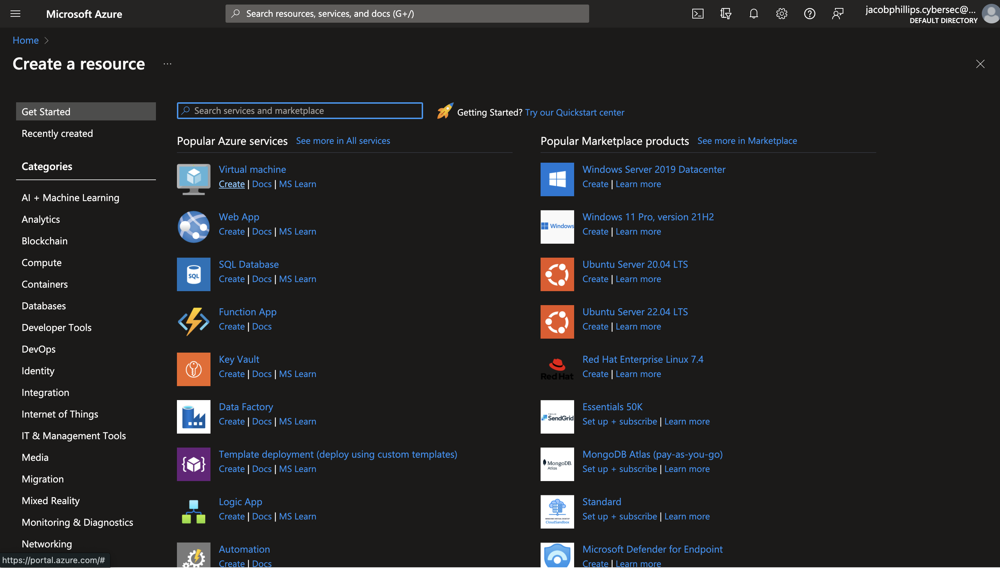
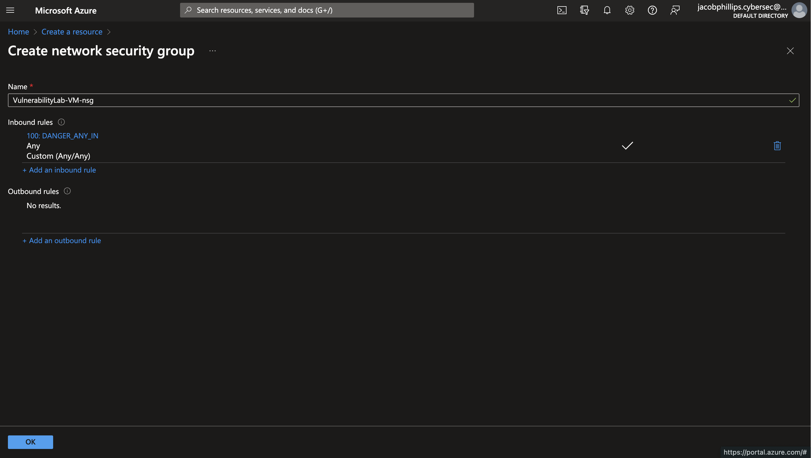

# Setting Up Vulnerable VMs in Azure

This repository contains instructions for setting up vulnerable virtual machines (VMs) in Azure. These VMs are intentionally configured with vulnerabilities for educational and testing purposes, allowing users to learn about common security issues and practice vulnerability assessment and mitigation techniques.

## Prerequisites

Before getting started, ensure you have the following:

- An Azure account ([Sign up here](https://azure.microsoft.com/en-us/free))
  -   If you're a student, you can use the [Azure for Students](https://azure.microsoft.com/en-gb/free/students) program.
  
- Basic knowledge of Azure services and virtual machines

## Setup Instructions

### Step 1: Create Virtual Machines

**Purpose:** Deploy virtual machines with intentionally vulnerable configurations.

1. Log in to the Azure portal.
   - I would recommend bookmarking the url for the Azure portal with the browser of your choice for ease of accessibility.

2. Navigate to the Create a resource service.   
3. Under "Virtual Machine" click on "Create" to begin the VM creation process.
   
    
   
5. Create a new resource group, with is a logical grouping of resources, where the VM will be placed.
     - Also give your VM a name, choose which region this VM will be hosted, availibility zone, and security type
     - For this example, I will be using a Windows 10 Image with x64 VM Architecture

        
   
6. Configure Administrator account for your VM.
     - The username and password you establish will be your credentials to access your VM.
     - Allow the Public Inbound Ports to stay at the default setting of "Allow Selected Ports" as RDP (Remote Desktop Protocol) is how we will access the VM.
     - Tick the Licensing checkbox, and press Next until you come to the Network portion of the VM creation steps.

       
       
7. Configure the NIC Network Security Group.
    - Here we will be creating a new Security Group that will essentially allow us access to modify the inbound rules of your VM.
    - Change the NIC Network Security Group to Advanced, and it will populate a new field.
    - With this "Configure Network Security" Group Field, click "Create New" underneath the dropdown.

      

8. Remove Default Inbound rule.
     - Once in this menu, you will see the default inbound rule, remove it by clicking the trash can icon to the right.
     - Then, click the "+ Add Inbound Rule" to create our new vulnerable inbound rule.

        
  
9. Create a Vulnerable Inbound Rule
     - IMPORTANT: This is for purposely creating a vulnerable resource and you would never do this otherwise.
     - Edit the Destination Port Ranges to be an asterisk "*", meaning allow any and all ports to be accessed.
     - Allow any protocol, and allow action
     - Change the Priority to 100
           - In Azure, the priority is used to determine the order in which the rules are processed. The lower the number, the higher the priority, and the earlier the rule is processed.
     - Lastly, add a name for this rule. In this case I put "DANGER_ANY_IN" to reflect this rule is very vulnerable as it can be accessed by anyone via any port.
     - Click the "Add" Button to add it to your inboud rules for your VM.
  
       
  
       
  
10. Create the VM
    - Once you've added the inbound rule, click the Create button at the bottom left.
    - This may take some time for Azure to "spin up" your VM, but once it is completed you'll see it with a status of "Running". 

### Step 2: RDP Onto The VM

**Purpose:** To Access the VM remotely.

1. Once the VM is created and running, open the Azure portal.
2. Navigate to the list of virtual machines.
3. Click on the VM you created.
4. Under the "Overview" section, find the "Public IP Address" field.
     
6. Click on "Connect" and select "RDP" to download an RDP file.
7. Open the downloaded RDP file and enter the username and password you set during VM creation.
8. Click "Connect" to establish an RDP connection to the VM.
9. You will now have remote access to the VM's desktop environment, allowing you to interact with it as if you were physically present.

### Step 3: Test Ping/Disable Firewalls

**Purpose:** Validate network connectivity and adjust firewall settings if necessary.

1. Open a command prompt or terminal on your local machine.
2. Ping the public IP address of the Azure VM to test network connectivity.
   - If you receive a response, the VM is reachable from your local machine.
   - If you encounter "Request timed out" messages, it may indicate firewall restrictions. Proceed to the next step.
3. Disable the firewall on the Azure VM temporarily for testing purposes:
   - Log in to the Azure portal.
   - Navigate to the network security group associated with your VM.
   - Edit the inbound security rules to allow ICMP traffic (ping) or disable the firewall entirely.
   - Test ping again from your local machine to verify connectivity.
   - Once confirmed, re-enable the firewall and adjust rules as necessary for your security requirements.

These steps ensure that you can establish remote desktop connections to the VM and troubleshoot any network connectivity issues by testing ping and adjusting firewall settings accordingly.

## Conclusion

Setting up vulnerable VMs in Azure provides an invaluable learning experience for understanding common security issues and practicing cybersecurity skills. By actively engaging with vulnerable environments, users can enhance their knowledge of security concepts, threat detection, and mitigation strategies, ultimately improving their ability to protect against real-world cyber threats.

